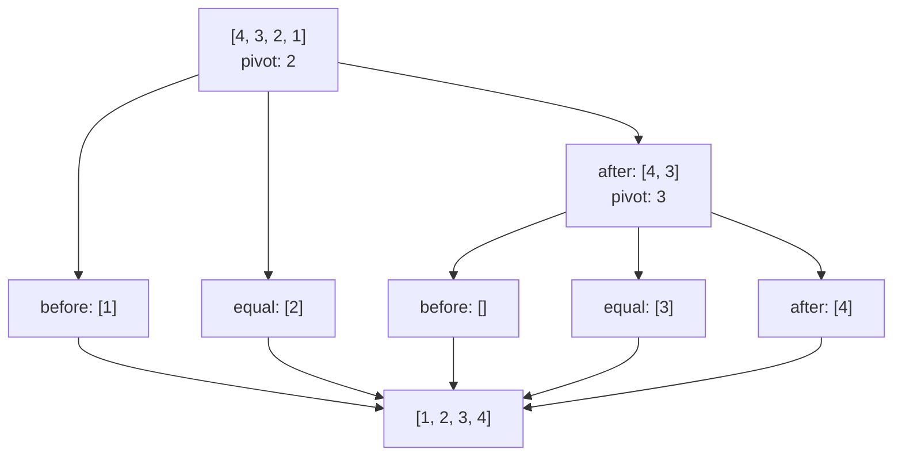

Quick sort is a **divide and conquer** algorithm. It picks one item, called the **pivot**, and splits the rest of the list around it. Then it sorts each side the same way until every piece has zero or one item.

## The idea

The Sort API always picks the middle item as the pivot. Each partition splits the list into three groups:

- `before`: items that sort before the pivot
- `equal`: items equal to the pivot
- `after`: items that sort after the pivot


```mermaid
flowchart TD
    A["[4, 3, 2, 1]<br/>pivot: 2"] --> B["before: [1]"]
    A --> C["equal: [2]"]
    A --> D["after: [4, 3]<br/>pivot: 3"]
    D --> E["before: []"]
    D --> F["equal: [3]"]
    D --> G["after: [4]"]
    B --> H["[1, 2, 3, 4]"]
    C --> H
    E --> H
    F --> H
    G --> H
```

## Partitioning a list

Partitioning is the only real work. Compare each item to the pivot and put it in the right group.

<Steps>
  <Step title="Pick the pivot">
    For `[4, 3, 2, 1]`, the middle item is `2`.
  </Step>
  <Step title="Split around the pivot">
    `1` goes in `before`, `2` goes in `equal`, and `4` and `3` go in `after`.
  </Step>
  <Step title="Sort each side and join">
    `before` has one item, so it's already sorted. Partition `after` the same way, then join `before + equal + after`.
  </Step>
</Steps>

## See it with the API

Ask `/sort/steps` to sort `[4, 3, 2, 1]` and it returns every partition:

<CodeGroup>
  ```bash Request
  curl -X POST http://localhost:8000/sort/steps \
    -H "Content-Type: application/json" \
    -d '{"numbers": [4, 3, 2, 1]}'
  ```

  ```json Response
  {
    "result": [1, 2, 3, 4],
    "count": 4,
    "order": "asc",
    "steps": [
      { "step": 1, "pivot": 2, "before": [1], "equal": [2], "after": [4, 3] },
      { "step": 2, "pivot": 3, "before": [], "equal": [3], "after": [4] }
    ]
  }
  ```
</CodeGroup>

Steps are listed depth-first. The API fully partitions the `before` side before it starts on the `after` side. Lists with zero or one item are already sorted, so they don't produce a step.

With `"order": "desc"`, `before` holds the items larger than the pivot and `after` holds the smaller ones.

<Info>
  Quick sort runs in O(n log n) time on average and O(n^2) in the worst case.
</Info>

<Expandable title="Read the code">
  The whole algorithm is a short recursive `quick_sort()` function in `main.py`. It picks the middle item as the pivot, builds the `before`, `equal`, and `after` lists, and calls itself on `before` and `after`.
</Expandable>

Ready to try it? Head to the [quickstart](/merge-sort-api/quickstart).
